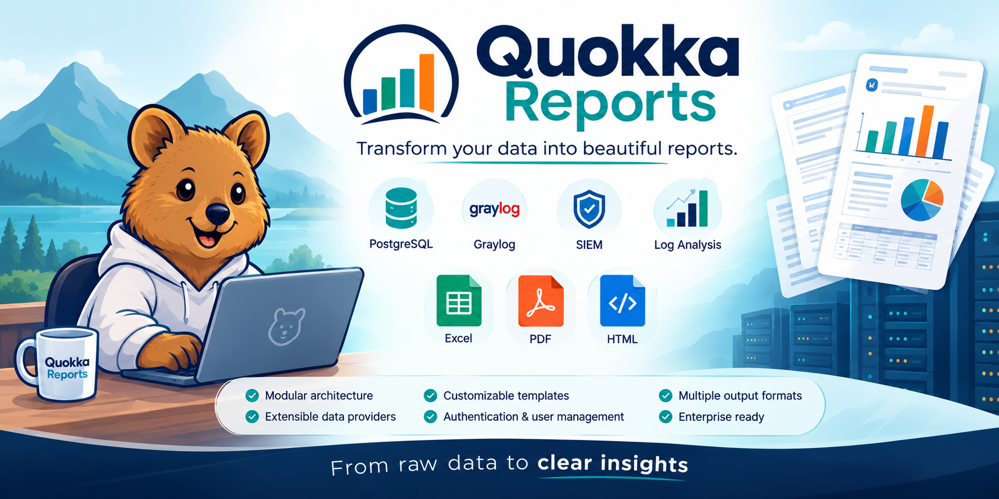

# 🦘 Quokka Reports

> **Trasforma i tuoi dati in report bellissimi.**



[](LICENSE)
[](https://python.org)
[](https://fastapi.tiangolo.com)

Quokka Reports è una piattaforma di reporting open-source che trasforma query SQL e fonti di dati esterni in report HTML, PDF ed Excel elegantemente formattati, grazie a un'architettura modulare basata su dataset, template e provider di dati插件.

---

[English](README.md) | [Italiano](README_ITA.md)

## 📑 Indice

- [Perché Quokka](#-perché-quokka)
- [Caratteristiche](#-caratteristiche)
- [Architettura](#-architettura)
- [Avvio Rapido](#-avvio-rapido)
- [Struttura del Progetto](#-struttura-del-progetto)
- [Configurazione](#-configurazione)
- [Gestione Utenti](#-gestione-utenti)
- [Autenticazione](#-autenticazione)
- [Formati di Output](#-formati-di-output)
- [Estensione di Quokka](#-estensione-di-quokka)
- [Risoluzione dei Problemi](#-risoluzione-dei-problemi)
- [Programma di Sviluppo](#-programma-di-sviluppo)
- [Contribuire](#-contribuire)
- [Ringraziamenti](#-ringraziamenti)
- [Supporto Professionale](#-supporto-professionale)
- [Licenza](#-licenza)

---

## 🚀 Perché Quokka

Quokka Reports è stato creato per risolvere problemi reali di reporting separando la fase di acquisizione dei dati da quella di presentazione.

Principi fondamentali:

- Separare l'acquisizione dei dati dalla presentazione.
- Promuovere definizioni di dataset riutilizzabili.
- Progettare report usando HTML e CSS standard.
- Rendere i provider di dati插件.
- Supportare più formati di output.

---

## ✨ Caratteristiche

### Reporting

- Output HTML, PDF ed Excel
- Report multi-dataset
- Esportazione Excel multi-sheet
- Template HTML responsive

### Fonti di Dati

- PostgreSQL
- Graylog
- Provider personalizzati

### Amministrazione

- Gestione interattiva degli utenti
- Attivazione e disattivazione degli utenti
- Gestione delle password

### Piattaforma

- FastAPI
- Supporto alla localizzazione
- Configurazione JSON
- Architettura modulare

---

## 🏗 Architettura

```text
 PostgreSQL     Graylog     REST APIs
      │             │            │
      └──────┬──────┴────────────┘
             ▼
      Provider di Dati Personalizzati
             ▼
      Definizioni di Dataset
             ▼
         Engine Quokka
             ▼
     HTML | PDF | Excel
```

---

## 🚀 Avvio Rapido

```bash
git clone https://github.com/andreachecchi/quokka-reports.git
cd quokka-reports
pip install -r requirements.txt
python management.py
python quokka.py
```

Apri il tuo browser all'indirizzo:

`http://localhost:7489`

---

## 📁 Struttura del Progetto

```text
data_providers/
datasets/
reports/
templates/
generated/
locales/
users.json
```

---

## 📝 Configurazione

I provider sono configurati tramite file JSON dei dataset.

Provider supportati:

| Provider | Scopo |
|----------|-------|
| postgresql | Database SQL |
| graylog | SIEM / Analisi dei log |

---

## 🛠 Gestione Utenti

Esegui:

```bash
python management.py
```

Funzionalità:

- Creare utenti
- Aggiornare utenti
- Eliminare utenti
- Attivare / Disattivare utenti
- Resettere le password
- Validare la configurazione

---

## 🔒 Autenticazione

- Le password sono memorizzate tramite hash SHA-256.
- Sono supportati sia il campo `active` che quello legacy `isactive`.

---

## 📊 Formati di Output

| Formato | Descrizione |
|---------|-------------|
| HTML | Report interattivi |
| PDF | Documenti stampabili |
| Excel | Cartelle di lavoro multi-sheet |

---

## 🔌 Estensione di Quokka

Crea un nuovo provider all'interno di `data_providers`:

```python
def fetch_data(dataset_config):
    return {
        "columns": [],
        "rows": []
    }
```

---

## 🐛 Risoluzione dei Problemi

Installa Playwright Chromium:

```bash
playwright install chromium
```

Verifica inoltre:

- Le credenziali del provider
- Gli identificativi dei dataset

---

## 🛣 Programma di Sviluppo

- Ulteriori provider di dati
- Pianificazione dei report
- API REST
- Grafici e dashboard
- Immagine Docker

---

## 🤝 Contribuire

Feedback, richieste di funzionalità e pull request sono benvenuti.

Si prega di aprire un Issue prima di iniziare modifiche significative, in modo da poter discutere l'implementazione proposta.

---

## 🙏 Ringraziamenti

Quokka Reports nasce dall'esperienza operativa maturata nel mondo reale.

Un ringraziamento speciale a **Qubit Futura Srl**, il cui lavoro nell'ambito di reti aziendali, cybersecurity, monitoraggio delle infrastrutture e piattaforme SIEM ha ispirato l'architettura e molte delle funzionalità del progetto.

---

## 🏢 Supporto Professionale


Hai bisogno di aiuto per distribuire Quokka Reports in produzione?

**Qubit Futura Srl** offre servizi professionali tra cui:

- Reti aziendali
- Cybersecurity
- SIEM e integrazione con Graylog
- Raccolta e normalizzazione dei log
- Provider di dati personalizzati
- Progettazione di report
- Integrazione infrastrutturale
- Consulenza tecnica

LinkedIn:

https://it.linkedin.com/company/qubitfutura-srl

---

## 📄 Licenza

Concesso in licenza secondo la Licenza AGPL v3.
